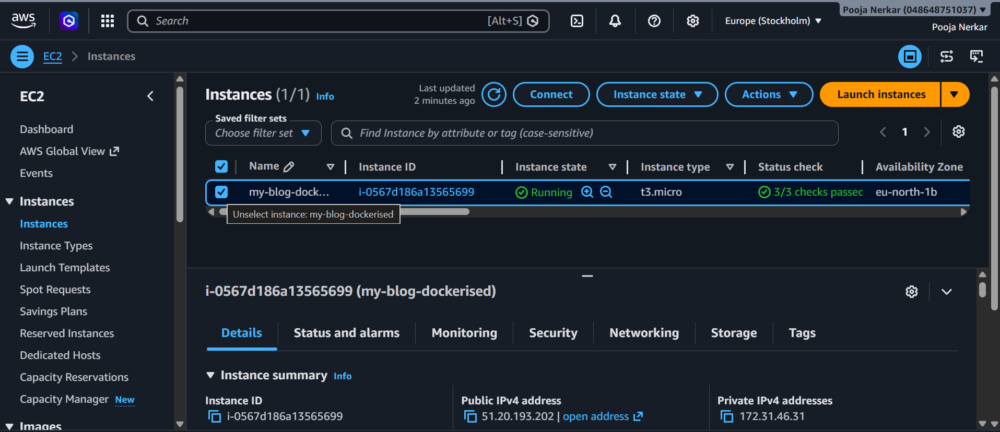
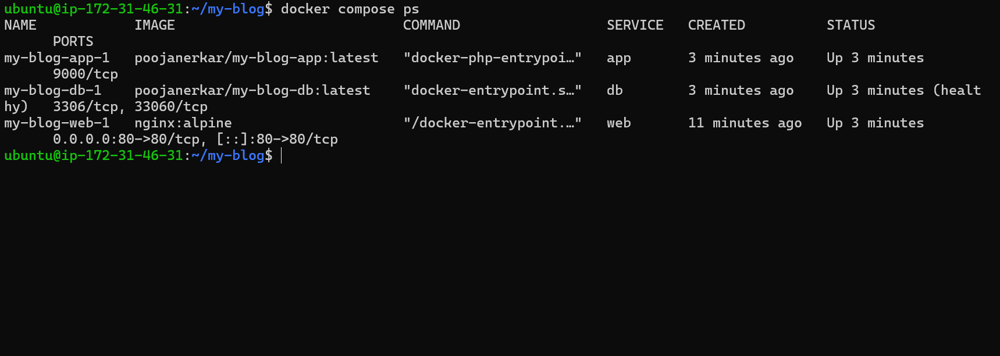
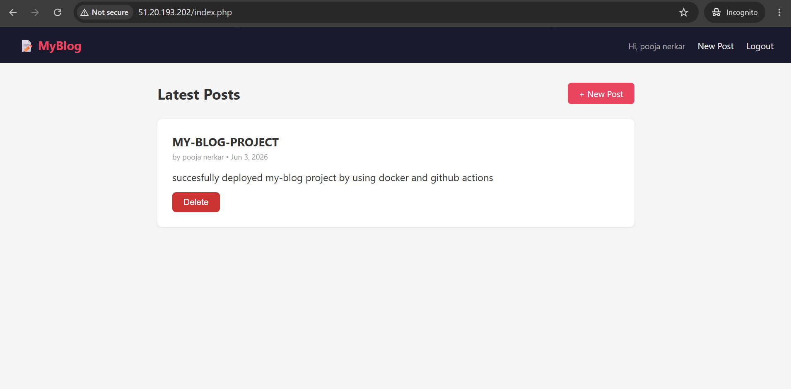
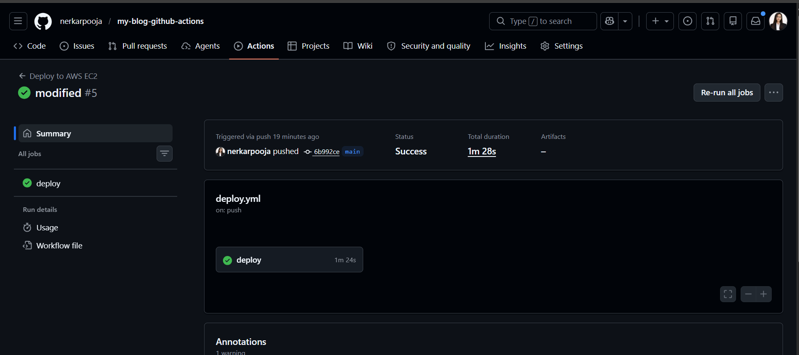
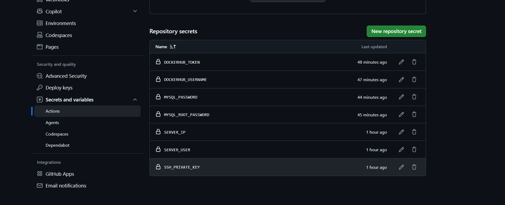
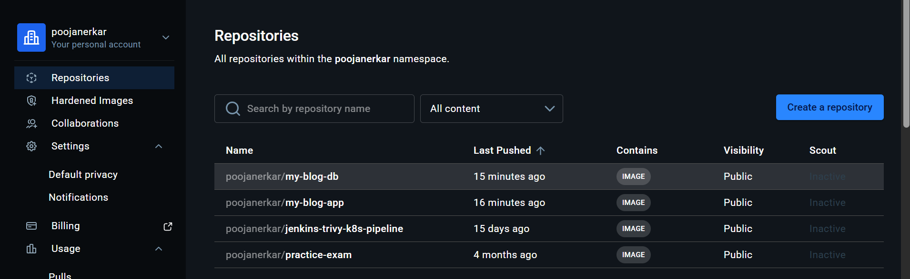

# My Blog — Dockerized Three Tier Application with CI/CD

A full-stack blog application containerized using Docker and deployed on AWS EC2 with an automated CI/CD pipeline using GitHub Actions and Docker Hub.

Users can register, login, create blog posts, and delete their own posts.

---

## Project Info

| Detail | Value |
|---|---|
| Author | Pooja Nerkar |
| Deployed on | AWS EC2 — eu-north-1 (Stockholm) |
| Instance | t3.micro, Ubuntu 22.04 LTS |
| Live URL | http://51.20.193.202 |
| Repository | [my-blog-github-actions](https://github.com/nerkarpooja/my-blog-github-actions) |

---

## Tech Stack

| Layer | Technology |
|---|---|
| Web Server | Nginx Alpine |
| Application | PHP 8.2 FPM Alpine |
| Database | MySQL 8.0 |
| Containerization | Docker, Docker Compose |
| Image Registry | Docker Hub |
| CI/CD | GitHub Actions |
| Cloud | AWS EC2 |
| OS | Ubuntu 22.04 LTS |

---

## Architecture

```
Developer Laptop
      |
      | git push
      v
GitHub (nerkarpooja/my-blog-github-actions)
      |
      | triggers workflow
      v
GitHub Actions Runner
      |-- builds poojanerkar/my-blog-app image
      |-- builds poojanerkar/my-blog-db image
      |-- pushes both to Docker Hub
      |
      | SSH into server
      v
AWS EC2 (51.20.193.202) — eu-north-1
      |
      |-- git pull (latest code)
      |-- docker compose pull (latest images)
      |-- docker compose up -d
      v
Blog is live at http://51.20.193.202
```

### Container Network Isolation

```
Internet
    |
    v (port 80)
+------------------+
|   Nginx (web)    |  -- webnet only
+------------------+
    |
    | FastCGI (port 9000)
    v
+------------------+
|  PHP-FPM (app)   |  -- webnet + dbnet (bridges both)
+------------------+
    |
    | MySQL (port 3306)
    v
+------------------+
|   MySQL (db)     |  -- dbnet only
+------------------+
```

Nginx cannot reach MySQL directly.
All database traffic must pass through the PHP application layer.
This is enforced by Docker network isolation.

---

## Project Structure

```
my-blog/
|-- .env                          credentials (never pushed to GitHub)
|-- .gitignore
|-- docker-compose.yml
|-- .github/
|   `-- workflows/
|       `-- deploy.yml            GitHub Actions workflow
|-- db/
|   |-- Dockerfile                custom MySQL image
|   `-- init.sql                  creates users and posts tables
|-- web/
|   `-- config/
|       `-- default.conf          Nginx reverse proxy config
`-- app/
    |-- Dockerfile                PHP image with mysqli and pdo extensions
    `-- code/
        |-- config/db.php         database connection using env vars
        |-- index.php             homepage
        |-- auth/
        |   |-- login.php
        |   |-- register.php
        |   `-- logout.php
        `-- posts/
            |-- create.php
            `-- delete.php
```

---

## How It Works

### Request flow

```
1. Browser opens http://51.20.193.202
2. Nginx receives request on port 80
3. Static HTML/PHP file is requested
4. For .php files Nginx forwards via FastCGI to PHP-FPM on port 9000
5. PHP-FPM executes the file
6. PHP connects to MySQL using hostname "db" (Docker internal DNS)
7. MySQL returns data
8. PHP builds HTML response
9. Response goes back through Nginx to browser
```

### Why "db" works as a hostname

Docker has a built-in DNS server for each network. The service name in docker-compose.yml becomes a hostname automatically. So `mysqli_connect("db", ...)` resolves to the MySQL container IP without any manual configuration.

---

## Dockerfiles

### app/Dockerfile

```dockerfile
FROM php:8.2-fpm-alpine
RUN docker-php-ext-install mysqli pdo pdo_mysql
```

The official PHP image does not include database extensions. `docker-php-ext-install` adds `mysqli` and `pdo_mysql` so PHP can connect to MySQL.

### db/Dockerfile

```dockerfile
FROM mysql:8.0
COPY init.sql /docker-entrypoint-initdb.d/
EXPOSE 3306
```

MySQL auto-runs any `.sql` file placed in `/docker-entrypoint-initdb.d/` on first boot. This creates the `users` and `posts` tables automatically.

No CMD needed in either Dockerfile — the base images already start the correct process.

---

## GitHub Actions Workflow

Every push to the `main` branch triggers this pipeline automatically:

```
Step 1 — Checkout code from GitHub
Step 2 — Login to Docker Hub using secrets
Step 3 — Build PHP-FPM image and push to poojanerkar/my-blog-app
Step 4 — Build MySQL image and push to poojanerkar/my-blog-db
Step 5 — SSH into EC2 server and:
           clone repo if first time
           git pull if already exists
           write .env from GitHub Secrets
           docker compose pull
           docker compose up -d
```

### GitHub Secrets used

| Secret | Purpose |
|---|---|
| SERVER_IP | EC2 public IP address |
| SERVER_USER | SSH username (ubuntu) |
| SSH_PRIVATE_KEY | Contents of .pem key file |
| DOCKERHUB_USERNAME | Docker Hub account username |
| DOCKERHUB_TOKEN | Docker Hub access token |
| MYSQL_ROOT_PASSWORD | MySQL root password |
| MYSQL_PASSWORD | MySQL app user password |

Secrets are encrypted and never visible after saving. The `.env` file is written on the server by the workflow using these secret values — it is never stored in the repository.

---

## Volumes

| Type | Host Path | Container Path | Service | Purpose |
|---|---|---|---|---|
| Named volume | vol1 (Docker managed) | /var/lib/mysql | db | MySQL data persists across restarts |
| Bind mount | ./app/code | /var/www/html | app | PHP files served directly |
| Bind mount | ./web/config | /etc/nginx/conf.d | web | Nginx config injected without rebuild |

`docker compose down` preserves data. Only `docker compose down -v` deletes the database volume.

---

## Setup and Deployment

### Server requirements

```
Ubuntu 22.04 LTS
t3.micro or higher
Port 22 open to your IP
Port 80 open to 0.0.0.0/0
```

### Install Docker on server

```bash
sudo apt update
sudo apt install docker.io -y
sudo apt install docker-compose-v2 -y
sudo systemctl start docker
sudo systemctl enable docker
sudo usermod -aG docker ubuntu
newgrp docker
```

### Verify

```bash
docker --version
docker compose version
```

### Add GitHub Secrets

Go to your repository → Settings → Secrets and variables → Actions and add all 7 secrets listed in the table above.

### Deploy

Push any change to the main branch:

```bash
git add .
git commit -m "your message"
git push origin main
```

GitHub Actions handles everything from that point. Check the Actions tab to watch it run.

---

## Screenshots

### EC2 Instance Running



Instance name: my-blog-dockerised
Region: eu-north-1 (Stockholm)
Status: Running, 3/3 checks passed

---

### Docker Containers Running on Server



All three containers up and healthy:
- my-blog-app-1 — poojanerkar/my-blog-app:latest — port 9000
- my-blog-db-1 — poojanerkar/my-blog-db:latest — healthy
- my-blog-web-1 — nginx:alpine — port 80

---

### Blog Live in Browser



Blog running at http://51.20.193.202
Logged in as pooja nerkar
Post created as proof of deployment

---

### GitHub Actions Workflow



Workflow triggered automatically on push to main branch.
Pipeline builds images, pushes to Docker Hub, and deploys to EC2.

---

### GitHub Secrets



All 7 secrets configured. Values are encrypted and never visible.
Passwords are never stored in any file that gets pushed to GitHub.

---

### Docker Hub Images



Both images built and pushed automatically by GitHub Actions:
- poojanerkar/my-blog-app
- poojanerkar/my-blog-db

---

## Key Things Learned

**Docker networking** — Containers communicate using service names as hostnames. Docker's built-in DNS resolves them automatically. `mysqli_connect("db")` works because Docker resolves "db" to the MySQL container IP.

**Why two networks** — webnet connects Nginx and PHP. dbnet connects PHP and MySQL. Nginx is never on dbnet so it can never reach the database directly even if compromised.

**Named volume vs bind mount** — Named volumes persist database data across container restarts. Bind mounts let you edit PHP files on the server and see changes instantly without rebuilding.

**GitHub Secrets for .env** — The .env file is never pushed to GitHub. Instead the workflow writes it on the server during deployment using values from GitHub Secrets. This means credentials are managed in one secure place.

**Build on GitHub, run on server** — GitHub Actions builds the Docker images on its own free runner and pushes them to Docker Hub. The server only pulls and runs ready images. This keeps the server lightweight and makes deployments faster.

**session_start() must come before HTML** — PHP cannot send headers after HTML output has started. All session handling and redirects must happen before including any file that outputs HTML.

---

## What Happens on Every git push

```
git push origin main
        |
        v
GitHub Actions triggers automatically
        |
        v
Builds new Docker images with latest code
        |
        v
Pushes images to Docker Hub
        |
        v
SSHs into EC2 server
        |
        v
Updates .env from GitHub Secrets
        |
        v
Pulls new images and restarts containers
        |
        v
Blog updated at http://51.20.193.202
No manual SSH, no manual SCP, nothing.
```

---

## Connect

LinkedIn: https://www.linkedin.com/in/pooja-nerkar
Email: poojanerkarofficial@gmail.com
Location: Pune, Maharashtra, India

---

*Project: Three Tier Dockerized Blog with GitHub Actions CI/CD*

